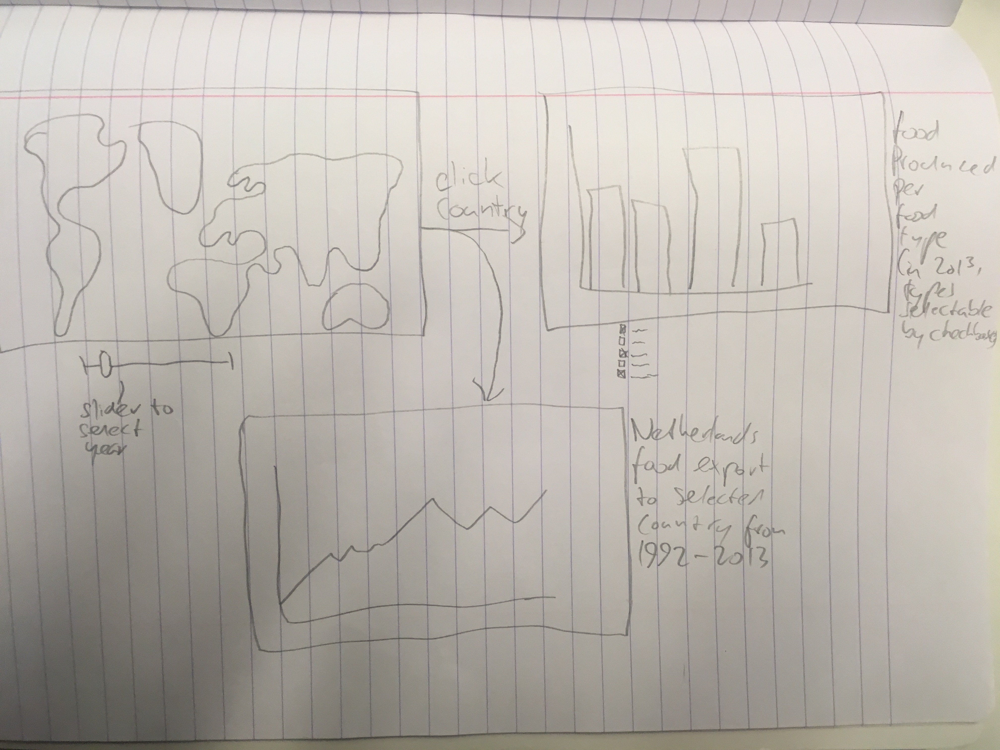

# Programmeerproject
Programming project for the programming minor at the University of Amsterdam

Jelle Witsen Elias

# Summary
This application will show food production throughout the world. The goal is to show people which countries produce which types of food, and what they have been producing throughout the past 50 years or so.

## Problem statement
The 'problem' that this project addresses is that people buy food in stores, but have no idea where it comes from and who actually produces it. This website tries to shine some light on this. The audience is everyone that buys food in shops (so almost everyone, but not chidren and people who grow everything they eat themselves).

## Solution
The solution is to show which food is grown by which countries, and how much of it per country. The website will also show how much the food has been grown over the course of the years, from 1961 to 2013.

The main features that will be available to users are that they are able to click on a country on a world map, and instantly see which foods are grown most by that country in a bar chart. They can then click on a bar in the bar chart, and they will see a line graph of the production of that food over the years in the specific country.

All of these features are part of the minimum viable product.

Features that won't be part of the minimum viable product will be a dropdown menu with which you can choose a specific continent to show in the map, and checkboxes that will allow you to change which food types are shown in the bar chart.

These features won't be part of the minimum viable product, but are important as well.

## Prerequisites
The data source is a Kaggle database:
[Database](https://www.kaggle.com/dorbicycle/world-foodfeed-production/data)

The external components used by the website are the d3 library for javascript:
[d3](https://d3js.org/)

The hardest part about this problem might be the double clickable charts. This means that it's possible to dive into the data two levels deep. With the proper use of different functions, I think it should be possible though.

